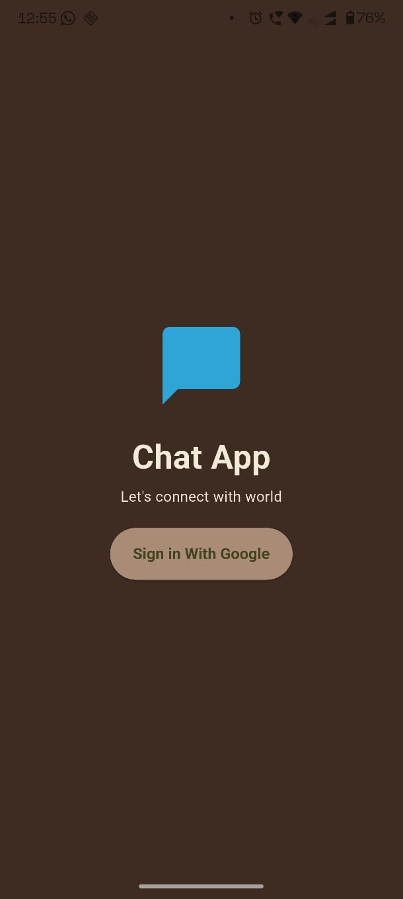
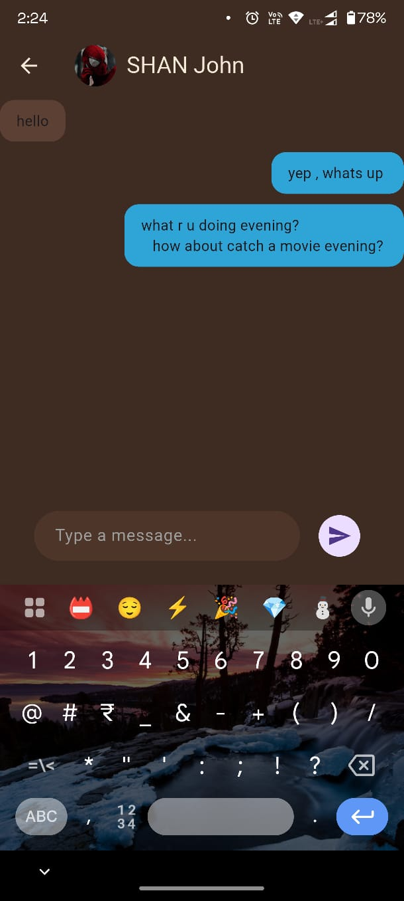

# 💬 Flutter Firebase Chat App

A **real-time chat application** built using **Flutter, Firebase Authentication, Cloud Firestore, and Riverpod**.

This project demonstrates how to build a **modern messaging application** with real-time updates, user search, and conversation management.

---

## 🚀 Features

* 🔐 Firebase Authentication (Google Sign-In)
* 💬 Real-time messaging with Firestore
* 👤 User search
* 📥 Automatic conversation creation
* ⚡ Live message streaming using Firestore snapshots
* 🧠 Riverpod state management
* 🕒 Timestamp-based message ordering
* 🎨 Clean and simple Flutter UI

---

## 📱 Application Download

You can download the APK from the link below:

**Google Drive APK**

```
https://drive.google.com/file/d/1mMZmNIbVKSVSijTzIzZgEAgeg55bMD-7/view?usp=sharing
```


---

## 📸 Screenshots

<p align="center">



</p>

---

## 🛠 Tech Stack

### Frontend

* Flutter
* Dart
* Riverpod

### Backend

* Firebase Authentication
* Cloud Firestore

---

## 📂 Project Structure

```
lib
│
├── models
│   └── message.dart
│
├── providers
│   └── message_provider.dart
│
├── screens
│   ├── home_screen.dart
│   ├── chat_screen.dart
│   └── search_sheet.dart
│
├── services
│   └── firestore_service.dart
│
├── widgets
│   └── message_bubble.dart
│
└── main.dart
```

---

## ⚙️ Setup Instructions

### 1. Clone the repository

```
git clone https://github.com/alin262/chat-app.git
```

### 2. Navigate to project

```
cd chat-app
```

### 3. Install dependencies

```
flutter pub get
```

### 4. Setup Firebase

1. Create a project in **Firebase Console**
2. Add Android application
3. Download **google-services.json**
4. Place it inside

```
android/app/
```

### 5. Run the application

```
flutter run
```

---

## 🧠 What I Learned

While building this project I learned:

* Flutter + Firebase integration
* Firestore real-time streams
* Riverpod state management
* Chat database design
* Real-time UI updates

---

## 🔮 Future Improvements

* Message delivery status
* Image sharing
* Push notifications
* Online / offline presence
* Group chats
* Voice messages

---

## 👨‍💻 Author

**Alin A S**

GitHub:
https://github.com/alin262

---

⭐ If you like this project, please give it a **star on GitHub**.
